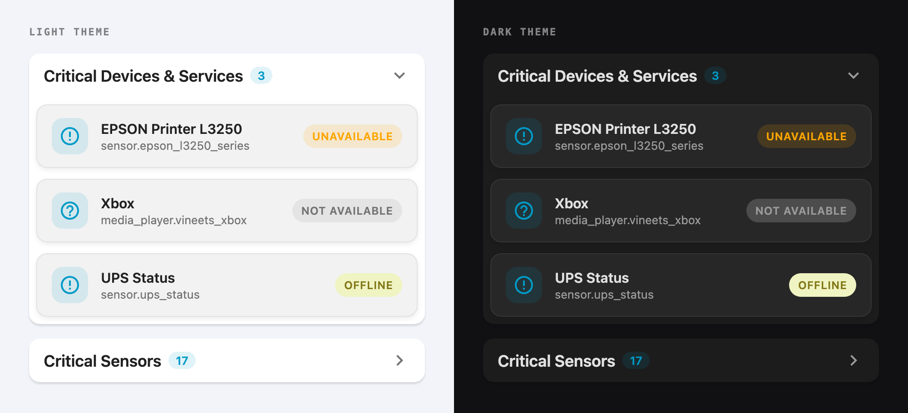
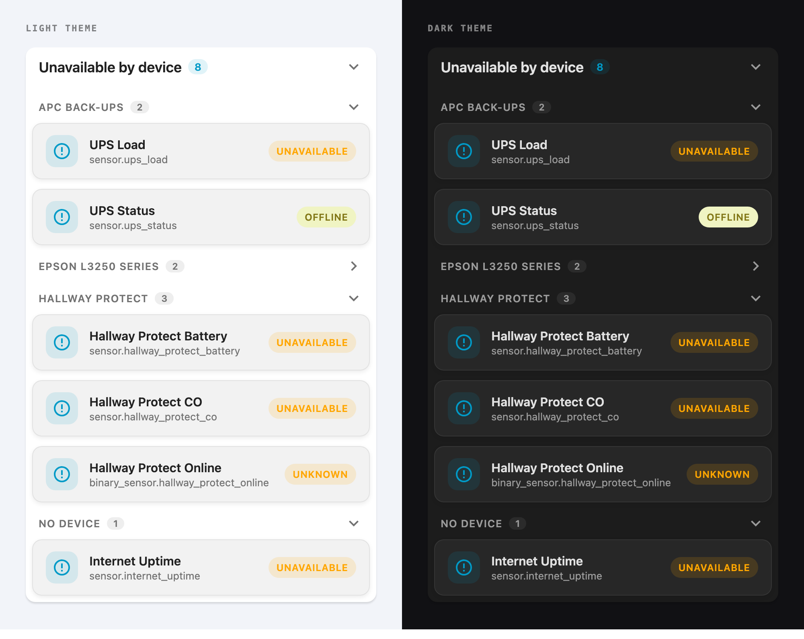

# Unavailable Entity Card

A Lovelace card that surfaces the entities Home Assistant has quietly lost. Point it at your whole install, or a slice of it, and it lists only what is `unavailable` or `unknown` right now in the native tile look.



## Contents

- [Features](#features)
- [Requirements](#requirements)
- [Installation](#installation)
- [Quick start](#quick-start)
- [Examples](#examples)
  - [Whole-home health card](#whole-home-health-card)
  - [Dead batteries only](#dead-batteries-only)
  - [Critical devices, several selectors at once](#critical-devices-several-selectors-at-once)
  - [A hand-picked watchlist](#a-hand-picked-watchlist)
  - [Custom states from an integration](#custom-states-from-an-integration)
  - [Grouped by device, integration or area](#grouped-by-device-integration-or-area)
  - [Compact badge for a header row](#compact-badge-for-a-header-row)
  - [One card per floor](#one-card-per-floor)
- [Configuration reference](#configuration-reference)
  - [Card options](#card-options)
  - [Entity options](#entity-options)
  - [`include` / `exclude` selectors](#include--exclude-selectors)
  - [Excluding a state](#excluding-a-state)
  - [`group_by` options](#group_by-options)
  - [`unavailable_states` options](#unavailable_states-options)
- [Using auto-entities](#using-auto-entities)
- [Troubleshooting](#troubleshooting)
- [Development](#development)
- [License](#license)

## Features

- **Finds them for you:** scan every entity, or select by wildcard, domain, label or area
- Native tile look: friendly name, entity id, state chip, and the entity's own icon or picture
- Shows only entities in an unavailable state
- Flags entities that no longer exist in Home Assistant at all as `not available`
- Custom states are yours to define: `offline`, `error`, `idle` with per-state badge colors
- Groups rows by device, integration, area or domain, so one dead device reads as one foldable heading
- Search box appears automatically once the list gets long
- Tapping a row opens the standard more-info dialog
- Theme-aware, responsive, and available from the card picker with a live preview

## Requirements
- Latest version of Home Assistant
- Nothing else

## Installation

### 1. Via HACS (recommended)

Installation is easiest through the [Home Assistant Community Store (HACS)](https://hacs.xyz/). Once HACS is set up, click the button below (requires [My Home Assistant](https://my.home-assistant.io/) configured) or follow the [instructions for adding a custom repository](https://hacs.xyz/docs/faq/custom_repositories), then find **Unavailable Entity Card** under **Frontend** and install it.

[](https://my.home-assistant.io/redirect/hacs_repository/?owner=vineetchoudhary&repository=lovelace-unavailable-entity-card&category=dashboard)

### 2. Manual install

1. Copy `unavailable-entity-card.js` to your Home Assistant `/config/www/unavailable-entity-card/` folder.
2. Add the resource through **Settings → Dashboards → Resources → +**:
   ```yaml
   url: /local/unavailable-entity-card/unavailable-entity-card.js
   type: module
   ```
3. Reload the browser cache (`Ctrl/Cmd + Shift + R`).

## Quick start

Add a manual card with this configuration:

```yaml
type: custom:unavailable-entity-card
title: Offline right now
all_entities: true
expanded: false
```

That is the whole card. Every entity in your install is watched, only the unavailable ones are listed, and a healthy install collapses to a single header row with no count badge.

Prefer to be specific? List the entities you care about instead:

```yaml
type: custom:unavailable-entity-card
title: Critical sensors
entities:
  - sensor.living_room_temperature
  - binary_sensor.garage_door
  - sensor.ups_status
```

Either style can be mixed with the other, and refined from there.

## Examples

### Whole-home health card

The one card most people want: everything, collapsed by default, searchable, sitting at the top of a dashboard as a quiet health indicator.

```yaml
type: custom:unavailable-entity-card
title: Unavailable entities
all_entities: true
expanded: false
search: true
exclude:
  entity_globs:
    - "*_last_seen"      # sensors that are unknown until they first report
    - "sensor.sun_*"
  domains: [device_tracker]   # away phones are legitimately unknown
```

`device_tracker` and "last seen" timestamps are the usual sources of permanent noise, excluding them is what turns this card from a long list into a card you actually trust. If `unknown` is noisy across the board rather than in a few places, drop the state itself with `exclude: states: [unknown]`.

### Dead batteries only

Wildcards match the entity id, so one glob covers every battery sensor you will ever add.

```yaml
type: custom:unavailable-entity-card
title: Batteries needing attention
include:
  entity_globs:
    - "sensor.*_battery"
    - "sensor.*_battery_level"
    - "binary_sensor.*_battery_low"
```

### Critical devices, several selectors at once

An entity is listed if it matches **any** `include` key, so selectors combine instead of narrowing. Label a handful of entities `Critical` in Home Assistant and this card keeps itself up to date.

```yaml
type: custom:unavailable-entity-card
title: Critical kit
include:
  labels: [Critical]
  areas: [Garage, Server rack]
  domains: [lock, alarm_control_panel]
  entity_globs: ["sensor.*_smoke"]
exclude:
  entities: [sensor.known_flaky]
  labels: [Ignore]
```

### A hand-picked watchlist

Explicit entries can be renamed and re-iconed, always appear in the order you wrote them, and are never removed by `exclude`.

```yaml
type: custom:unavailable-entity-card
title: Infrastructure
entities:
  - entity: binary_sensor.nas_online
    name: NAS
    icon: mdi:server-network
  - entity: sensor.ups_status
    name: UPS
    icon: mdi:power-plug-battery
  - entity: binary_sensor.zigbee_coordinator
    name: Zigbee coordinator
    icon: mdi:zigbee
  - sensor.internet_uptime
```

### Custom states from an integration

Plenty of integrations report their own idea of "unavailable" like `offline`, `error`, `disconnected`. Add them, and give each one a badge color.

```yaml
type: custom:unavailable-entity-card
title: Printers and network gear
include:
  domains: [sensor, binary_sensor]
  entity_globs: ["*.printer_*", "*.switch_port_*"]
unavailable_states:
  - state: [offline, disconnected]
    background: "rgba(255, 152, 0, 0.18)"
    color: "#e65100"
  - state: error
    background: "rgba(244, 67, 54, 0.18)"
    color: "#b71c1c"
  - state: unavailable
    background: "rgba(158, 158, 158, 0.18)"
    color: "var(--secondary-text-color)"
```

`unavailable` and `unknown` are always included, anything you add here is on top of them.

### Grouped by device, integration or area

One dead device usually takes half a dozen entities down with it. `group_by: device` collapses that into a single heading with a count, so a flat list of eight rows reads as "three things are wrong" instead.



```yaml
type: custom:unavailable-entity-card
title: Unavailable by device
all_entities: true
group_by: device
```

Each heading folds on click, so you can acknowledge the printer and keep looking. Group by whatever answers your question: `integration` when you suspect one integration has dropped its connection, `area` when a room is dark, `domain` for a quick shape of what kind of thing is failing.

```yaml
type: custom:unavailable-entity-card
title: Which integration died?
all_entities: true
group_by: integration
groups_expanded: false     # start with every heading folded
```

### Compact badge for a header row

With `show_header: false` the card is just the list, which makes it a good citizen inside a `vertical-stack` or a grid where a heading already exists.

```yaml
type: vertical-stack
cards:
  - type: markdown
    content: "## System health"
  - type: custom:unavailable-entity-card
    show_header: false
    all_entities: true
```

### One card per floor

`areas` accepts an area name, one of its aliases, or its area id, and falls back to the entity's device when the entity itself has no area.

```yaml
type: grid
columns: 2
cards:
  - type: custom:unavailable-entity-card
    title: Upstairs
    include:
      areas: [Bedroom, Bathroom, Landing]
  - type: custom:unavailable-entity-card
    title: Downstairs
    include:
      areas: [Kitchen, Living Room, Hallway]
```

## Configuration reference

### Card options

| Option | Required | Default | Description |
| --- | --- | --- | --- |
| `type` | **Yes** | — | `custom:unavailable-entity-card` |
| `entities` | Conditional | — | Entities to monitor, as ids or [objects](#entity-options). Required unless `all_entities` or an `include` key is set |
| `all_entities` | Conditional | `false` | Watch every entity in Home Assistant. Required unless you set `entities` or `include` |
| `include` | No | — | Narrow the automatic search — see [selectors](#include--exclude-selectors). Setting any key enables scanning |
| `exclude` | No | — | Remove automatically found entities. Same keys as `include`, and it wins over `include`. Also takes `states` to stop reporting a state such as `unknown` — see [excluding a state](#excluding-a-state) |
| `include_hidden` | No | `false` | Include entities hidden in the Home Assistant entity registry |
| `title` | No | `Unavailable entities` | Card header text |
| `show_header` | No | `true` | `false` drops the header, count badge and collapse control |
| `expanded` | No | `true` | `false` starts the card collapsed |
| `group_by` | No | `none` | Group rows under foldable headings, by `device`, `integration`, `area` or `domain` — see [options](#group_by-options) |
| `groups_expanded` | No | `true` | `false` starts every group folded |
| `search` | No | *(automatic)* | Force the search box on or off, regardless of list length |
| `search_threshold` | No | `20` | How many entities must be listed before the search box appears on its own |
| `unavailable_states` | No | `[unavailable, unknown]` | Extra states to treat as unavailable, with optional colors — see [options](#unavailable_states-options) |

### Entity options

Each item under `entities` is either an entity id string, or an object:

| Option | Description |
| --- | --- |
| `entity` | **Required.** The entity id |
| `name` | Label for the row. Defaults to the entity's friendly name, or the entity id |
| `icon` | Icon for the row, e.g. `mdi:server-network`. Defaults to the entity's own icon or picture |

### `include` / `exclude` selectors

Every key accepts a single value or a list, and matching is case-insensitive.

| Key | Matches |
| --- | --- |
| `entities` | Exact entity ids |
| `domains` | The part before the dot — `sensor`, `light`, `binary_sensor` |
| `entity_globs` | Wildcard patterns over the entity id, same syntax as Home Assistant's own `entity_globs`: `*` for any run of characters, `?` for exactly one |
| `labels` | A label's name or its underlying label id. Matches the entity's own labels **and** those of its device |
| `areas` | An area's name, one of its aliases, or its area id. Uses the entity's area, falling back to its device's area |
| `states` | **`exclude` only.** States the card should stop reporting — see [excluding a state](#excluding-a-state) |

```yaml
include:
  entities: sensor.always_watch_this   # single value, no list needed
  domains: [binary_sensor, lock]
  entity_globs: ["sensor.*_battery", "light.garden_?"]
  labels: [Critical]
  areas: [Living Room, Garage]
exclude:
  entity_globs: "*_last_seen"
  labels: [Ignore]
  states: [unknown]
```

### Excluding a state

`unavailable` and `unknown` are both reported by default. If you want to exlcude any of these states, list it under `exclude: states:` and the card stops reporting it entirely.

```yaml
type: custom:unavailable-entity-card
title: Unavailable entities
all_entities: true
exclude:
  states: [unknown]     # only genuinely unavailable entities are listed
```

- Matching is case-insensitive, and a single value works without a list.
- It applies to any state the card watches, including the ones you added with `unavailable_states`.
- Unlike the other `exclude` keys, this one also applies to entities you listed explicitly under `entities:` — an entity in an excluded state is not reported no matter how it got onto the card.
- Excluding every state the card watches is a config error rather than a card that can never show anything. To watch only your own states, exclude both defaults and add yours:

  ```yaml
  unavailable_states: [offline]
  exclude:
    states: [unavailable, unknown]
  ```

### `group_by` options

| Value | Groups by | Heading text |
| --- | --- | --- |
| `none` | *(default)* nothing, a flat list | — |
| `device` | The entity's device | The name you gave the device in Home Assistant, else its own name, else its device id |
| `integration` | The integration that provides the entity | The integration's name as Home Assistant knows it, e.g. `zwave_js` reads **Z-Wave JS** |
| `area` | The entity's area, falling back to its device's area | The area name |
| `domain` | The part of the entity id before the dot | The domain title, e.g. `binary_sensor` reads **Binary sensor** |

`devices`, `platform`, `service`, `rooms` and the other obvious plurals are accepted as aliases. A value that is not one of these is a config error rather than a silently flat card.

How it behaves:

- Headings sort by name, and the leftover group (`No device`, `No area`, `No integration`) always sorts last. Rows keep their order inside a group.
- The count on a heading is that group's own rows. The card's own count badge still reports the total.
- Click a heading, or focus it and press <kbd>Enter</kbd>, to fold it. Folding survives Home Assistant's state updates and resets when you change the card's configuration.
- While you are searching, every group is rendered open so a match is never hidden behind a fold, and groups with no match disappear. Your folds come back when the query is cleared.
- Grouping reads the entity and device registries. If nothing can be resolved, the card renders a plain flat list rather than one pointless `No device` heading, so turning `group_by` on is never destructive. `domain` needs no registry at all.
- A row showing `not available` no longer exists in Home Assistant, so it has no device, area or integration, and collects in the leftover group.

### `unavailable_states` options

`unavailable` and `unknown` are treated as unavailable unless you turn one off with [`exclude: states:`](#excluding-a-state). This option adds more, and optionally styles their badge. Three forms are accepted:

```yaml
# 1. A single state
unavailable_states: offline
```

```yaml
# 2. A list of states, or of objects
unavailable_states:
  - offline
  - state: error
    background: "rgba(244, 67, 54, 0.18)"
    color: "#b71c1c"
  - state: [idle, standby]      # one style, several states
    background: "#eceff1"
```

```yaml
# 3. A map of state to style
unavailable_states:
  offline: "#f0f4c3"            # string shorthand for background
  unknown:
    background: "#fff59d"
    color: "#827717"
    border: "1px solid #cddc39"
```

| Field | Description |
| --- | --- |
| `state` | The state, or a list of states, this entry applies to. `states` is accepted as an alias |
| `background` | Badge background. Any CSS value — color, `var(--…)`, or a gradient |
| `color` | Badge text color |
| `border` | Badge border, e.g. `1px solid #cddc39` |
| `value` | Alias for `background` |

All values are inserted as inline styles, so theme variables and gradients work as well as plain colors.

## Using auto-entities

The card's own selectors cover most cases, but it also works as the wrapped card for [auto-entities](https://github.com/thomasloven/lovelace-auto-entities) if you already use it:

```yaml
type: custom:auto-entities
card:
  type: custom:unavailable-entity-card
  title: Critical kit
filter:
  include:
    - label: Critical
```

The card accepts an empty entity list, so it renders its empty state rather than an error when the filter matches nothing.

## Troubleshooting

- **Custom card not found:** check the resource URL is registered (`/hacsfiles/…` for HACS, `/local/…` for a manual install) and hard-refresh the browser.
- **The card is empty:** that is the good outcome that means nothing is unavailable. Confirm it is working by temporarily adding a state you do have, e.g. `unavailable_states: 'on'`.
- **An entity I expected is missing:** it may be `hidden` (set `include_hidden: true`), `disabled` (Home Assistant never exposes those), excluded by an `exclude` key, or in a state you turned off with `exclude: states:`.
- **`labels:` or `areas:` match nothing:** check the name against **Settings → Areas & labels**.
- **A row says `not available`:** the entity id does not exist. Check it against **Developer tools → States**, or remove it from `entities:`.
- **Too much noise:** `device_tracker` entities and `*_last_seen` timestamps are legitimately `unknown` much of the time. Exclude them rather than living with them, or drop the whole state with `exclude: states: [unknown]`.
- **`group_by: device` puts everything under `No device`:** those entities genuinely have no device, which is normal for helpers, template entities and integrations that register entities directly. If *every* row lands there the card falls back to a flat list.
- **An integration heading reads `Zwave Js` rather than `Z-Wave JS`:** the card asks Home Assistant for the integration's name and falls back to prettifying the raw key when the frontend has no translation loaded for it. Reload the dashboard.
- **Custom colors ignored:** each entry in an `unavailable_states` list needs its own `state` key alongside the style fields.

## Development

- The distributed file is `unavailable-entity-card.js`. No build tooling requires, it is ready-to-serve JavaScript. Edit it and refresh your dashboard.
- `test/index.html` is a dependency-free browser test suite. Open it in Chrome; it loads `../unavailable-entity-card.js` directly, so it always exercises the real card file.
- `test/preview.html` renders the card in the configurations used for the screenshots above, and `test/capture-preview.sh` regenerates them after a UI change. It takes an optional size and case: `./test/capture-preview.sh 1000 795 --case=grouped` rewrites the grouping screenshot.

## License

MIT © 2025
